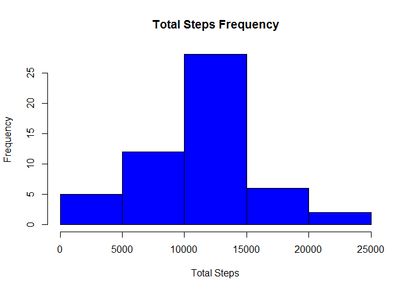
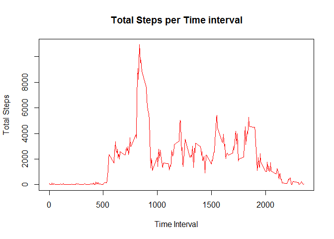
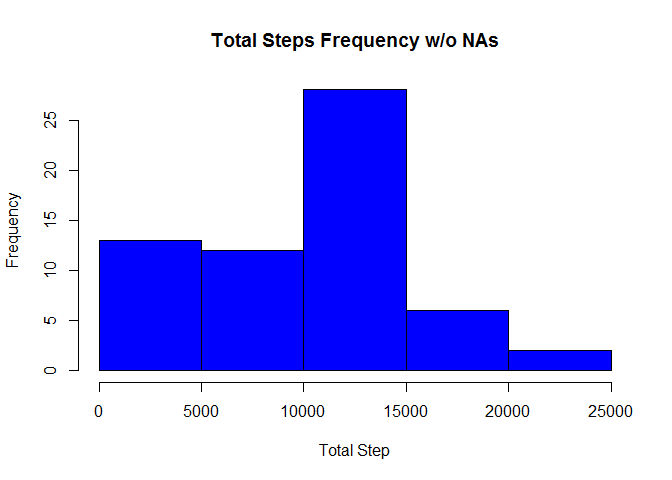
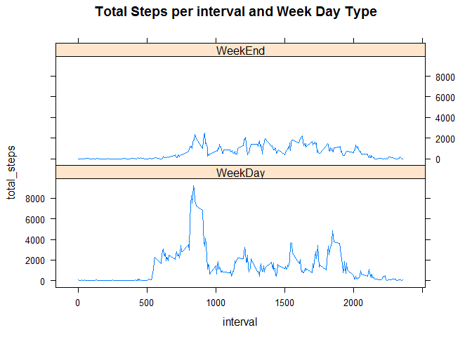

# Reproducible Research: Peer Assessment 1

In order to do the analysis, these are the tasks that needs to be done:

## Load the needed libraries

```r
library("lubridate")
```

```
## Warning: package 'lubridate' was built under R version 3.2.1
```

```r
library("lattice")
library("dplyr")
```

```
## Warning: package 'dplyr' was built under R version 3.2.1
```

```
## 
## Attaching package: 'dplyr'
## 
## The following objects are masked from 'package:lubridate':
## 
##     intersect, setdiff, union
## 
## The following objects are masked from 'package:stats':
## 
##     filter, lag
## 
## The following objects are masked from 'package:base':
## 
##     intersect, setdiff, setequal, union
```


## Loading and preprocessing the data

```r
if(!file.exists("activity.csv")) {
  download.file("https://d396qusza40orc.cloudfront.net/repdata%2Fdata%2Factivity.zip", destfile = "repdata_data_activity.zip", method = "curl")
    unzip("repdata_data_activity.zip")
}

activity <- read.csv("activity.csv",stringsAsFactors = FALSE)
```

## What is mean total number of steps taken per day?
    For this part of the assignment, you can ignore the missing values in the dataset.


```r
activity_date <- activity %>% 
    group_by (date) %>%
       filter( !is.na(steps)) %>%
         summarize( total_steps = sum(steps))

hist(activity_date$total_steps, xlab = "Total Steps", main = "Total Steps Frequency", col = "blue" )
```

 

    Calculate the total number of steps taken per day
    Calculate and report the mean and median of the total number of steps taken per day


```r
# calculate the total, mean and median
steps_total <- sum(activity_date$total_steps)
steps_mean <- mean(activity_date$total_steps)
steps_median <- median(activity_date$total_steps)
```
 - The total number of steps done by day is 570608
 - The mean of steps done by day is 10766.19
 - The median of steps done by day is 10765


## What is the average daily activity pattern?
    Make a time series plot (i.e. type = "l") of the 5-minute interval (x-axis) and the average number of steps taken, averaged across all days (y-axis)


```r
activity_interval <- activity %>% 
    group_by (interval) %>%
       filter( !is.na(steps)) %>%
       summarize( total_steps = sum(steps)
                  , median_steps = median(steps))

plot(activity_interval$interval, 
        activity_interval$total_steps,
          type = "l", xlab = "Time Interval",
      ylab = "Total Steps", col = "red",
        main = "Total Steps per Time interval"
            )
```

 

    Which 5-minute interval, on average across all the days in the dataset, contains the maximum number of steps?


```r
steps_max <- activity_interval[activity_interval$total_steps == max(activity_interval$total_steps) , 1]

#Format the step_max to show it in a HH:MI format
steps_max <- paste("000", as.character(steps_max), sep="")
steps_max <- substr(steps_max, nchar(steps_max)-3, nchar(steps_max))
steps_max <- paste(substr(steps_max, 1, 2), ":", substr(steps_max, 3, 4), sep = "")
```
The maxiumn number of steps is performed on the 08:35 interval


## Imputing missing values
Note that there are a number of days/intervals where there are missing values (coded as NA). The presence of missing days may introduce bias into some calculations or summaries of the data.

    Calculate and report the total number of missing values in the dataset (i.e. the total number of rows with NAs)

```r
total_NAs <- sum(is.na(activity$steps))
```
There is a total of 2304 missing values in the original Data Set


    Devise a strategy for filling in all of the missing values in the dataset. The strategy does not need to be sophisticated. For example, you could use the mean/median for that day, or the mean for that 5-minute interval, etc.

    Create a new dataset that is equal to the original dataset but with the missing data filled in.


    The new dataset is called: activity_noNAs. It was defined that each NA value in the steps variable, will be replaced by the median value of the steps for the same interval:
  

```r
aux <- merge(activity, activity_interval, by = "interval" )

# If there is an NA value, add the median. Otherwise, keep the existing steps value
aux$steps <- ifelse(is.na(aux$steps), aux$median_steps, aux$steps)

activity_noNAs <- aux[ , 1:3]
```

    Make a histogram of the total number of steps taken each day and Calculate and report the mean and median total number of steps taken per day. Do these values differ from the estimates from the first part of the assignment? What is the impact of imputing missing data on the estimates of the total daily number of steps?


```r
activity_date <- activity_noNAs %>% 
    group_by (date) %>%
       summarize( total_steps = sum(steps))

hist(activity_date$total_steps, xlab = "Total Step", main = "Total Steps Frequency w/o NAs", col = "blue" )
```

 


```r
# calculate the total, mean and median
steps_total <- sum(activity_date$total_steps)
steps_mean <- mean(activity_date$total_steps)
steps_median <- median(activity_date$total_steps)
```
  When removing the NA values of the step variable:

 - Total number of steps done by day: 579736
 - Mean of steps done by day: 9503.869
 - Median of steps done by day: 10395

  While the total number of steps increases (as there are more steps to summarize), the mean and the median decrease in comparision to the measurements taken excluding NAs.

## Are there differences in activity patterns between weekdays and weekends?
For this part the weekdays() function may be of some help here. Use the dataset with the filled-in missing values for this part.

    Create a new factor variable in the dataset with two levels - "weekday" and "weekend" indicating whether a given date is a weekday or weekend day.


```r
  # Create a new variable indicating if it is a weekend or weekday
  activity_noNAs$weekDay_Type = as.factor(ifelse(wday(as.Date(activity_noNAs$date)) %in% c(1,7), "WeekEnd", "WeekDay"))
```

    Make a panel plot containing a time series plot (i.e. type = "l") of the 5-minute interval (x-axis) and the average number of steps taken, averaged across all weekday days or weekend days (y-axis). See the README file in the GitHub repository to see an example of what this plot should look like using simulated data.


```r
  activity_weekDay <- activity_noNAs %>% 
    group_by (interval, weekDay_Type) %>%
       summarize( total_steps = sum(steps))

  xyplot( total_steps ~ interval | weekDay_Type , activity_weekDay, type = "l", layout = c(1,2), main = "Total Steps per interval and Week Day Type")
```

 
    
During Week Days there is a major distance in the number of steps performed, while during the weekend the same patron is stable along the day (without exceeding the 3000 steps on average). 

This person is much more active during week days, reaching a peak of 8K steps
